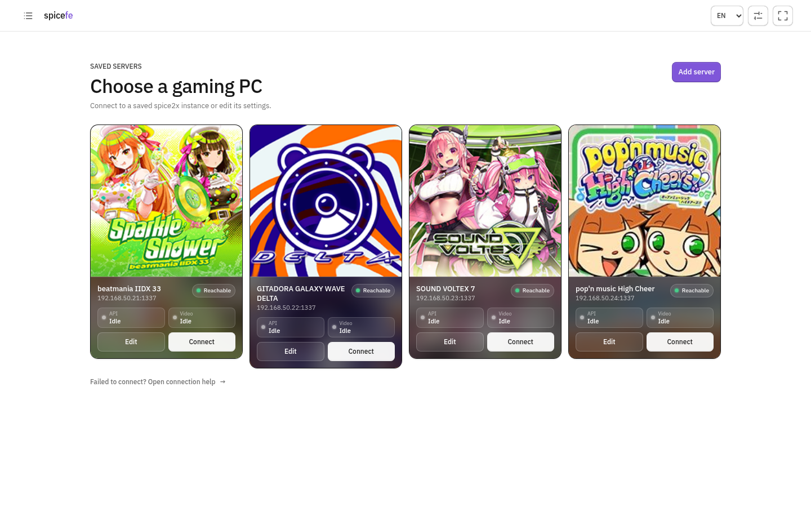
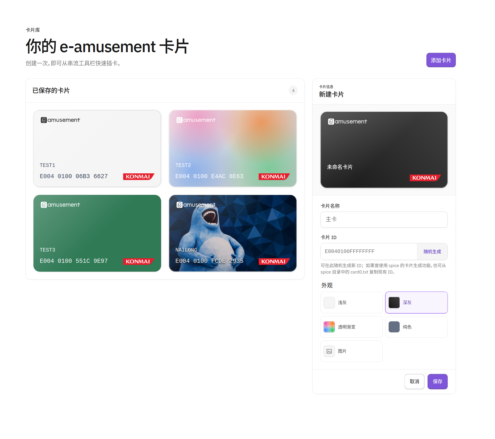
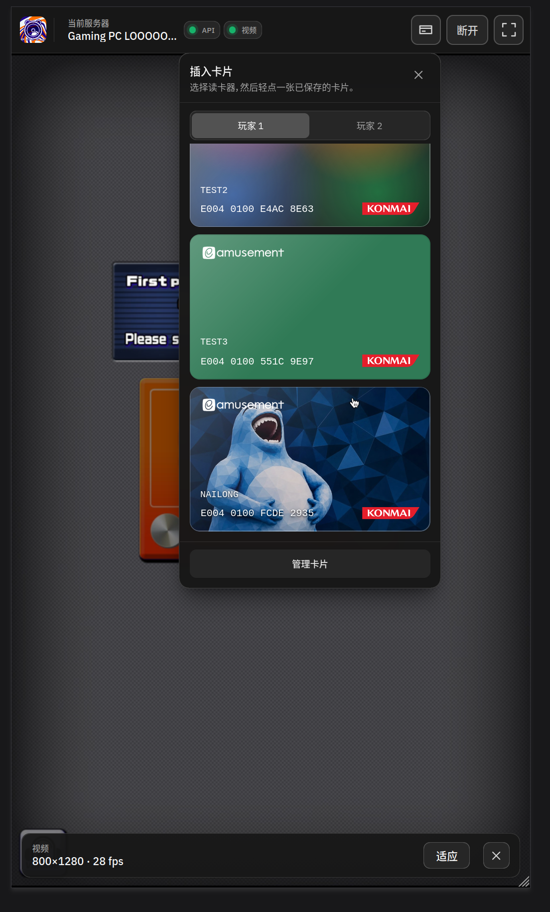
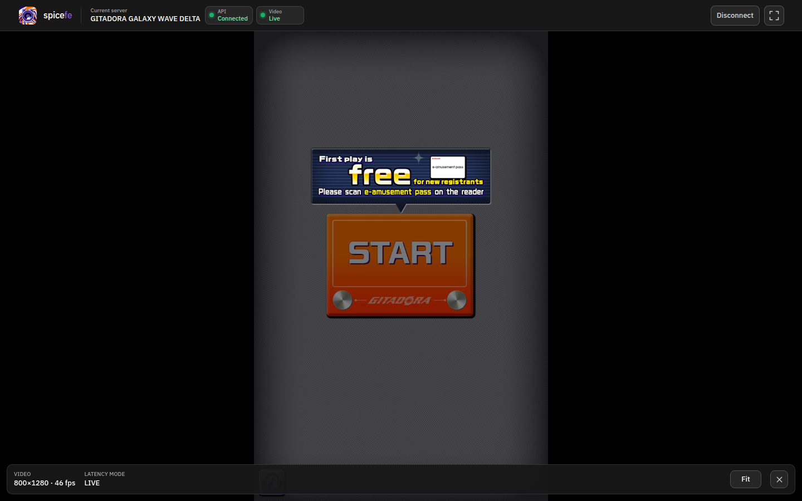

# spicefe

> [!WARNING]
> **Use only on a trusted LAN.** spice2x sends unauthenticated video over plain
> HTTP, its optional API password uses legacy RC4, and spicefe stores saved
> passwords as plain text in browser `localStorage`. A copy of spicefe loaded
> over HTTP can also be modified in transit. Prefer a supported per-site HTTPS
> exception on desktop, and deploy only reviewed artifacts through a static
> host you trust.

[简体中文](./README.zh-CN.md)

[](https://github.com/Avimitin/spicefe/actions/workflows/ci.yml)

## Showcase

| Welcome | Saved server diagnostics |
| :---: | :---: |
| [](./docs/screenshots/welcome.png) | [](./docs/screenshots/server-library.png) |

| Card management | Insert cards while streaming |
| :---: | :---: |
| [](./docs/screenshots/card-library.png) | [](./docs/screenshots/card-insert.png) |

**Live GITADORA GALAXY WAVE DELTA subscreen**

[](./docs/screenshots/gitadora-stream.png)

**Old beatmania IIDX 16-segment display**

<video src="https://raw.githubusercontent.com/Avimitin/spicefe/main/docs/showcase/iidx-16-segment-display.mp4" controls></video>

`spicefe` is a globally hostable, static LAN client for the spice2x subscreen
stream and old beatmania IIDX cabinet ticker. Open the page on a phone, tablet,
or another modern browser, select a saved gaming PC, and the browser connects
directly to spice2x for video and touch input or a nine-character ticker.

There is no relay and no companion web server to run on the gaming PC. The
static host only delivers this application; stream and input traffic stay on
the LAN.

## Version 0.1 scope

- H.264 video with WebCodecs first and a Media Source Extensions fallback
- automatic MJPEG fallback when H.264 is unavailable
- an optional, responsive red-on-black nine-character display for older
  beatmania IIDX releases, read through spice2x `iidx.ticker_get()` without
  opening the video endpoint
- separate Welcome and Saved Servers pages with top-bar navigation; first-time
  users start on Welcome, while returning users with saved servers start in the library
- per-server Host, control-API, and video-server indicators with independent
  failure details, refreshed every minute while the server library is visible
- mouse, single-touch, and multi-touch input
- Fit, Fill, and Stretch display modes with correct touch coordinate mapping
- a dismissible in-stream adjustment bar, restorable from the top bar
- a browser-local e-amusement card library with native-format card generation,
  P1/P2 insertion from the stream toolbar, and customizable card artwork
- multiple named connection profiles in `localStorage`, each with a selectable
  categorized game icon or locally uploaded, center-cropped artwork shown beside
  the PC name
- explicit Connect, Disconnect, and Switch behavior; a reload never reconnects
- English and Simplified Chinese UI with browser-language detection and a saved
  manual language choice
- a dedicated browser-setup page with instructions for Safari, Edge, Chrome,
  and Firefox on iOS, iPadOS, Windows, and Android
- disconnect immediately clears the final decoded frame and every playback
  backend
- responsive phone, tablet, and desktop UI

Audio, clipboard sharing, simultaneous subscreens, WAN relay, and legacy
browsers are intentionally outside this release.

## Data path

The API port entered in the UI is the spice2x base port:

| Purpose | Browser endpoint for API port 1337 | Protection |
| --- | --- | --- |
| Touch, game info, card insertion, and IIDX ticker | `ws://PC:1338` | Optional spice2x password; legacy RC4 |
| H.264 or MJPEG video | `http://PC:1339` | None |

The CDN never proxies either connection. H.264 is decoded directly with
WebCodecs when available, with bursty decoder output coalesced to the newest
frame for each display refresh. Otherwise, the pinned pure-JavaScript jMuxer
package repackages Annex-B into fragmented MP4 in the client for MSE; it does
not transcode the video.

The saved-server page briefly opens the configured API WebSocket and sends the
same read-only `info/avs` query used when establishing a full session. Normal
video profiles also send a `HEAD` request to the configured video endpoint;
spice2x answers before allocating a capture screen, so the check does not start
an encoder or claim a capture screen. Ticker profiles never contact the video
endpoint and instead follow the API check with a read-only `iidx/ticker_get`
request. Checks run when the list opens, every minute while it remains visible,
and after the browser regains network access.

Any response from either service confirms that the host is reachable over the
LAN. API authentication can therefore be red while Host remains green. When
neither service responds, spicefe reports **No response** rather than claiming
that a browser-level check can distinguish an offline host, broken route,
firewall rule, or blocked local-network request.

## Custom server icons

Open the game-icon picker in a connection profile and select **Upload image**
to use a PNG, JPEG, or WebP file. spicefe takes the largest centered square,
resizes it to at most 384×384 on the device, and saves only that result in browser
`localStorage`; the source file is never uploaded. Saved artwork appears at the
top of the picker under **Custom Icons** and can be reused by multiple server
profiles. Up to 24 custom icons are kept. Removing one makes profiles that
referenced it display the default spice2x icon instead.

## Old IIDX 16-segment display

When creating or editing a connection, enable **Enable 16 Segment Display** for
an older beatmania IIDX release with the cabinet ticker. This choice is saved
with the profile and can be turned off later. Stream-quality settings are hidden
in this mode because spicefe opens only the control API, then polls the native
read-only `iidx.ticker_get()` function at 10 Hz.

Select **Preview display** beside the option to test the same renderer without a
server or game. Short text stays still; longer text moves through the nine
positions one character every 0.5 seconds and wraps after a blank separator.
Choose **Screenshot view** to hide every control, then tap anywhere to bring
the controls back. The preview is entirely local and does not attempt a
spice2x connection.

The view deliberately exposes exactly nine character positions, matching
spice2x and the original cabinet hardware. It keeps a fixed 27:5 aspect ratio,
scales with the available screen, and renders pure red characters on a pure
black panel with a restrained fluorescent glow. Recent IIDX releases may offer
only a subscreen; use normal video mode for those releases.

## Virtual cards

Open **Card library** from the top-left page menu to create and edit virtual
e-amusement cards. New cards start with a blank ID. Use **Generate** for the
native `E0040100` pattern followed by eight random hexadecimal digits, or copy
an existing ID from `card0.txt` in the spice directory if you previously used
spice's card generator. Manually entered IDs must contain exactly 16
hexadecimal characters.

Cards use the Untitled UI gray-light treatment by default. Each card can
instead use the matching gray-dark style, a solid color, the
transparent-gradient treatment, or an uploaded PNG, JPEG, or WebP background.
Uploaded artwork is resized on the device and stored with the card in browser
`localStorage`; it is never uploaded by spicefe. Very long names remain on one
line and scroll within their fixed name area. Card numbers use the locally
served Bitcount Single variable font, with the device's monospace font as a
fallback.

While a video or ticker session is live, select the card icon in the top bar,
choose Player 1 or Player 2, then select a card. spicefe sends the native
`card.insert(reader, card_id)` request over the active control-API connection
and closes the menu automatically.

## Gaming PC setup

Install the [latest spice2x release](https://github.com/spice2x/spice2x.github.io/releases).
The minimum supported build is
[`spice2x-26-08-20`](https://github.com/spice2x/spice2x.github.io/releases/tag/26-08-20),
which introduced the required subscreen stream and CORS support. For subscreen
video, launch the game with options equivalent to:

```text
spice64.exe ... -api 1337 -apipass choose-a-lan-password -apistream
```

The old IIDX ticker needs the API but not the video server:

```text
spice64.exe ... -api 1337 -apipass choose-a-lan-password
```

The password is optional, though recommended by spice2x. Permit inbound TCP to
port 1338 for the browser API, plus port 1339 when using video. The browser does
not use the raw TCP listener on 1337, but spice2x still requires `-api` to create
the browser-facing listener.

On the client device, enter the PC's private IPv4 address when possible, such
as `192.168.1.50`. Both devices must be on the same LAN and client isolation
must be disabled on the Wi-Fi network.

## Browser setup

spice2x currently exposes only plain HTTP and WebSocket endpoints. That creates
an unavoidable browser-security boundary for a globally served page:

> [!IMPORTANT]
> When the instructions below call for the HTTP page, manually enter the whole
> address: **`http://spicefe.avimit.in/`**. Do not enter only the domain name;
> browser history and address-bar autocomplete may choose the previously visited
> HTTPS address instead.

| Device and browser | Recommended page | What to do |
| --- | --- | --- |
| iPhone or iPad · Safari | HTTP | Open a new tab, enter the complete `http://` address above, and verify the loaded address still begins with `http://`. Use the local-server helper if Safari upgrades it. |
| Windows · Edge or Chrome | HTTPS | Open this site's permissions, allow **Insecure content**, then allow **Local network access** when offered. |
| Windows · Firefox | HTTPS | Open the padlock's connection-security panel, select **Disable protection for now**, then allow access to local network devices. |
| Android · Edge or Chrome | HTTP | Temporarily turn off **Always use secure connections** if enabled, enter the complete `http://` address, then allow local-network access. |

The app includes the same bilingual instructions as a dedicated **Browser
setup** page, reachable from the top-left page menu. It also provides the exact
HTTP address for the current deployment and a copy button. If a public domain
still upgrades to HTTPS because of HSTS, browser policy, or network policy, use
the bundled Windows local-server helper documented below.

HTTP and HTTPS are separate browser origins, so they have separate
`localStorage`. Saved profiles are deliberately not placed in a URL or copied
between them; configure the server again after moving to the HTTP page.

The deployment therefore must serve both HTTP and HTTPS without redirecting
all HTTP traffic to HTTPS if its public HTTP page is intended to work.

Relevant platform references:

- [Chrome site permissions](https://support.google.com/chrome/answer/114662)
- [Chrome secure-connection settings on Android](https://support.google.com/chrome/answer/10468685?co=GENIE.Platform%3DAndroid&hl=en)
- [Edge Local Network Access](https://support.microsoft.com/en-us/edge/control-a-website-s-access-to-the-local-network-in-microsoft-edge)
- [Edge HTTPS-First mode](https://support.microsoft.com/en-us/edge/secure-your-web-browsing-with-https-first-mode-in-microsoft-edge)
- [Firefox mixed-content controls](https://support.mozilla.org/en-US/kb/mixed-content-blocking-firefox)
- [Firefox local-network permissions](https://support.mozilla.org/en-US/kb/control-personal-device-local-network-permissions-firefox)
- [Safari address-bar instructions](https://support.apple.com/guide/iphone/browse-the-web-iph1fbef4daa/ios)
- [W3C Mixed Content](https://www.w3.org/TR/mixed-content/)
- [WebCodecs AVC registration](https://www.w3.org/TR/webcodecs-avc-codec-registration/)

## Deploying the static site

Run the full reproducibility and test gate first:

```sh
nix flake check
nix build
```

The deployable directory is `result/`. The committed `public/` directory is
also already complete and can be directly uploaded without a build step.
Build the downloadable ZIP, including the Windows local-server helper, with
`nix build .#release`.

### GitHub Actions

The [`CI` workflow](./.github/workflows/ci.yml) runs for pull requests and
pushes to `main`. It runs every flake check, builds the site, confirms that the
committed `public/` directory matches the Nix result, and uploads that result
as the seven-day `spicefe-public` artifact.

After a successful push to `main`, the workflow also uploads the same
dereferenced output as a GitHub Pages artifact and deploys it from a separate
job. Pull requests keep read-only permissions; only the deployment job receives
`pages: write` and `id-token: write`. The workflow never commits generated
files, so no generated `gh-pages` branch is needed.

The [`Release` workflow](./.github/workflows/release.yml) runs for every pushed
Git tag. It reruns the flake checks, builds the `release` package, and creates a
GitHub Release with a versioned ZIP, SHA-256 checksum, and generated release
notes. The archive is built entirely by Nix from the same site derivation used
for Pages. For example:

```sh
git tag v0.2.0
git push origin v0.2.0
```

If a release already exists for that tag, rerunning the workflow replaces its
two generated assets instead of creating a duplicate release.

To enable deployment, open **Settings → Pages** in the GitHub repository and
set **Source** to **GitHub Actions**. Configure a custom domain and leave
**Enforce HTTPS** disabled so its HTTP page remains available. The default
`github.io` address cannot provide that HTTP endpoint. If the
domain uses Cloudflare DNS, keep the record **DNS only** and do not enable HSTS
or an HTTPS redirect elsewhere in front of GitHub Pages.

GitHub Pages does not process `_headers`, so the custom response headers used
by Cloudflare Pages are not applied on this deployment target. This does not
change the direct-LAN connection design, but it provides less browser-policy
hardening than hosts that support those headers.

GitHub Actions and the official NixOS installer are pinned to complete commit
IDs. The installer executable is additionally pinned to Nix `2.35.1` and
verified against a repository-recorded SHA-256 before it runs.

### EdgeOne Pages

Direct-upload `public/` (or the contents of `result/`). The included
`edgeone.json` applies the response headers. In the domain's HTTPS settings,
leave **Force HTTPS** disabled so `http://your-client-domain` remains usable.

### Cloudflare Pages

Use no framework and no build command, with `public` as the output directory.
The included `_headers` file is consumed by Pages. Use a custom domain and
disable **Always Use HTTPS** for that zone; do not enable HSTS on this client
hostname. The `pages.dev` hostname cannot provide the required public HTTP
page.

The deployment details referenced above are documented by
[GitHub Pages custom workflows](https://docs.github.com/en/pages/getting-started-with-github-pages/using-custom-workflows-with-github-pages),
[GitHub Pages HTTPS configuration](https://docs.github.com/en/pages/getting-started-with-github-pages/securing-your-github-pages-site-with-https),
[EdgeOne direct upload](https://pages.edgeone.ai/document/direct-upload),
[EdgeOne HTTPS configuration](https://pages.edgeone.ai/document/https-configuration-overview),
[Cloudflare Pages headers](https://developers.cloudflare.com/pages/configuration/headers/),
and [Cloudflare Always Use HTTPS](https://developers.cloudflare.com/ssl/edge-certificates/additional-options/always-use-https/).

## Local deployment

The in-app **Self-hosting** page in the top-left menu contains the same setup,
network, update, and troubleshooting guide in English and Simplified Chinese.
Self-hosting is the most reliable option when a public domain is upgraded to
HTTPS by HSTS or browser policy.

### Windows release helper

Windows does not include a standalone `cmd.exe` web-server command, and IIS is
an optional system component that would be excessive for this use. Supported
Windows client versions do include Windows PowerShell 5.1, so the release ZIP
ships `serve.bat` and a small PowerShell static server built on .NET
`TcpListener`.

To serve spicefe directly from the gaming PC:

1. Download a release ZIP and its `.sha256` file, verify it, and extract the
   ZIP.
2. Double-click `serve.bat`. It listens on port `45000` and opens a local test
   page.
3. If Windows Firewall prompts, allow **Private networks** only.
4. On the phone or tablet, open one of the cyan LAN URLs printed in the server
   window, such as `http://192.168.1.50:45000/`.
5. Keep the window open while playing; press **Ctrl+C** to stop the server.

Optionally verify the ZIP from PowerShell and compare the result with the
downloaded `.sha256` file before extracting it:

```powershell
Get-FileHash .\spicefe-vX.Y.Z.zip -Algorithm SHA256
```

Run `serve.bat 8080` from Command Prompt to choose a different port. The helper
does not install a service, change firewall rules, require administrator
rights, or download anything. Its execution-policy override applies only to
that one PowerShell process. It is intentionally a trusted-LAN development
server, not an Internet-facing server.

The implementation relies on the Windows-included
[Windows PowerShell 5.1](https://learn.microsoft.com/en-us/powershell/module/microsoft.powershell.core/about/about_windows_powershell_5.1?view=powershell-5.1)
and [.NET `TcpListener`](https://learn.microsoft.com/en-us/dotnet/api/system.net.sockets.tcplistener).

### Nix on Linux or macOS

Use a tagged repository checkout for a reproducible local deployment:

```sh
git clone https://github.com/Avimitin/spicefe.git
cd spicefe
git checkout vX.Y.Z
nix flake check
SPICEFE_BIND=0.0.0.0 SPICEFE_PORT=45000 nix run
```

Nix builds the same pinned site used by CI and supplies the Python server; no
global npm install is needed. `0.0.0.0` exposes the page to the LAN, so restrict
the machine's firewall to trusted/private networks. Leave the process running
while playing and press **Ctrl+C** to stop it.

### Opening and maintaining the local page

- Manually enter the complete cyan URL printed by the helper, including
  `http://` and `:45000`. Do not use `127.0.0.1` on the phone: it points back to
  the phone itself.
- If the page does not open, test `127.0.0.1` on the server PC first, then check
  the LAN address, Private-network firewall access, shared Wi-Fi, and client
  isolation.
- If the page opens but streaming fails, the static deployment is working.
  Recheck the spice2x API stream setting, spice2x version, API port and password,
  and its separate firewall ports.
- To update, stop the old server, verify and extract the new release into a new
  folder, and start it with the same address and page port. The browser retains
  saved profiles for that origin.
- Never expose the helper through router port forwarding. Advanced users may
  serve `result/` or `public/` with another HTTP static server, but must use
  normal JavaScript and WOFF2 MIME types; opening `index.html` through `file://`
  is unsupported.

## Local development

The flake pins Nixpkgs and supplies Node.js and Python. No global npm install is
needed.

```sh
nix develop
npm test
python tools/check_static.py public
```

To serve the built site on the development machine:

```sh
nix run
```

It listens on `127.0.0.1:45000` by default. To expose it to another LAN device:

```sh
SPICEFE_BIND=0.0.0.0 SPICEFE_PORT=45000 nix run
```

## Dependency policy

The only browser dependency is `jmuxer@2.1.1`, a pure-JavaScript package with
no transitive dependencies. It is exact-version locked with npm integrity
metadata and has no install lifecycle scripts. The Nix build passes
`--ignore-scripts`, downloads the dependency through a fixed-output Nix
derivation, and byte-compares its distribution and license with the copies in
`public/vendor/` before producing the site. No executable npm binary is
downloaded or run.

## Interface and font assets

The interface adapts the neutral palette, compact component geometry, focus
states, and restrained shadows of the MIT-licensed open-source
[`untitleduico/react`](https://github.com/untitleduico/react) design system.
It remains plain static HTML, CSS, and JavaScript; React, Tailwind CSS, and
React Aria are not runtime or build dependencies.

IBM Plex Sans is the primary interface font. Four small Latin-1 and symbol
subsets (Regular and Medium) are pinned to IBM's
[`@ibm/plex-sans@1.1.0`](https://github.com/IBM/plex/releases/tag/%40ibm%2Fplex-sans%401.1.0)
release and served from the same static origin. CSS tries an installed IBM Plex
Sans first, so the font files are not downloaded when the device already has
them. The welcome headline uses self-hosted
[Libre Caslon Text](https://github.com/impallari/Libre-Caslon-Text) Regular,
pinned to an exact upstream revision as a non-flake Nix input. Nix converts the
upstream TTF to WOFF2 reproducibly and verifies the checked-in browser asset.
CSS checks for a locally installed copy first, and Chinese uses a local serif
fallback. Other scripts use local system fallbacks, and no font CDN or live
third-party request is used. Virtual card numbers use
[Bitcount Single](https://github.com/petrvanblokland/TYPETR-Bitcount), pinned
to an exact revision and reproducibly converted from the requested variable TTF
to WOFF2 by Nix; the asset is served locally with a system monospace fallback.
The old IIDX ticker uses the monospaced face of
[Sixteen by Jack Sivak](https://stuffjackmakes.com/sixteen-font/), pinned to an
exact upstream revision as a non-flake Nix input and served locally without a
font CDN. Nine dim all-on glyphs are stacked beneath the active text to expose
the unlit segments. Sixteen is separately licensed under the SIL Open Font
License 1.1, which permits use in commercial and noncommercial applications;
the full license and provenance record ship with the site.

## Artwork provenance

The favicon and default profile artwork are the unmodified official spice2x
icon from pinned revision `b9c8afb`; its GPLv3 license ships with the site.
The profile icon picker also includes a 25-image whitelist from
[`bicarus-dev/bemani_fan_site_icons`](https://github.com/bicarus-dev/bemani_fan_site_icons)
at pinned revision `225e494`: all 21 available beatmania IIDX images (18 arcade
release images plus INFINITAS and ULTIMATE MOBILE artwork), GITADORA GALAXY
WAVE DELTA, SOUND VOLTEX 6–7, and pop'n music High Cheer. The arcade set spans
releases 18–33 and includes the supplied pre-release and location-test
variants. The picker groups those icons by game, and the Nix build reconstructs
the deployed icon directory from the whitelist so no other upstream artwork is
shipped.

The BEMANI icon repository provides no license and says the artwork was
gathered from the KONAMI BEMANI fan site. Operators must obtain any permission
required to redistribute or publicly serve those images. No affiliation with
or endorsement by KONAMI or the individual games is implied. Exact provenance
and the upstream README are included in
[`public/vendor/bemani-fan-site-icons/`](./public/vendor/bemani-fan-site-icons/).

Artwork uploaded through the custom-icon picker remains browser-local and is
not part of the distributed site or the upstream BEMANI icon whitelist.

## Security model

Use this only on a trusted home LAN:

- spice2x sends video in clear text and does not authenticate the stream port.
- Its optional API password uses RC4, which is legacy encryption rather than a
  modern secure channel.
- Profiles, including passwords, are intentionally stored as plain text in the
  browser's `localStorage` so they are ready after reopening the page.
- Uploaded server icons and virtual-card artwork are stored as encoded image
  data in that browser origin's `localStorage`; spicefe does not upload them.
- An HTTP page does not authenticate the static application in transit. A
  network attacker could replace its JavaScript, so prefer the documented
  per-site HTTPS exception where it works and trust the network used for HTTP.
- A deployed static host controls executable code with access to the saved
  profile and LAN endpoints. Deploy from reviewed artifacts and use a host you
  trust.

There is no telemetry, remote account, service worker, or automatic connection
on page load.

## Acknowledgements

Protocol and client behavior were derived from the spice2x source tree and the
BSD-licensed [`spice2x/substream`](https://github.com/spice2x/substream)
reference client. The site identity uses the official spice2x icon, and the
optional game artwork comes from `bicarus-dev/bemani_fan_site_icons`. The UI
treatment is adapted from open-source Untitled UI React and uses IBM Plex Sans;
the welcome headline uses Libre Caslon Text. See
[THIRD_PARTY_NOTICES.md](./THIRD_PARTY_NOTICES.md) for licenses, revisions, and
the BEMANI artwork caveat.
