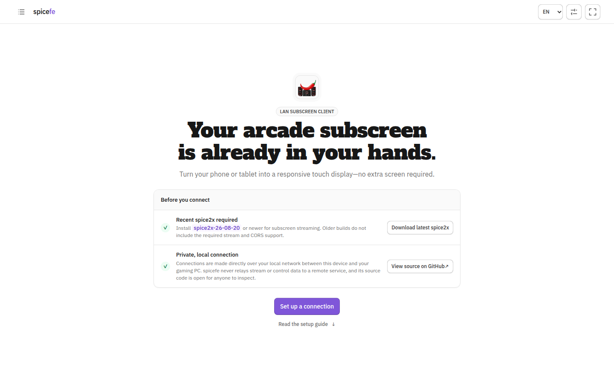
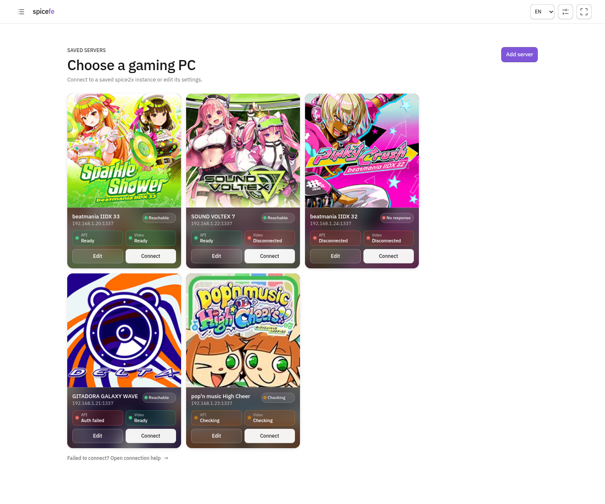
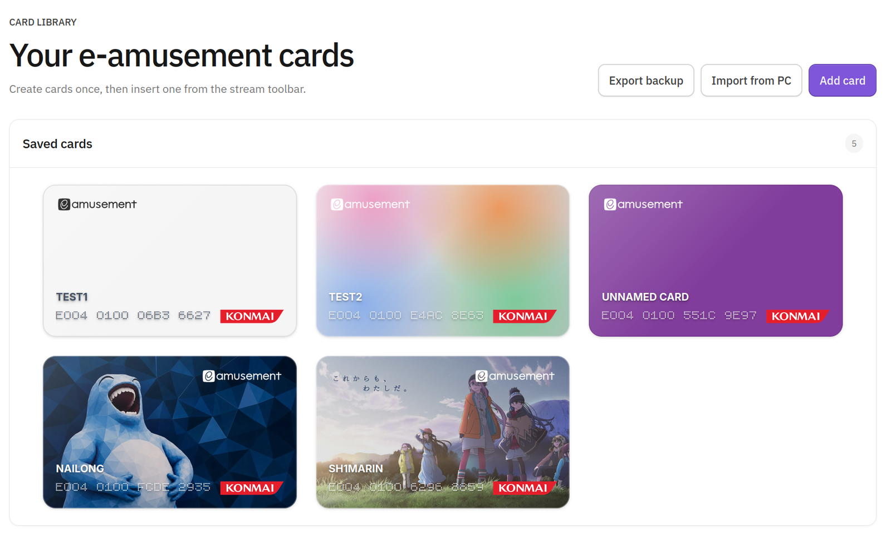
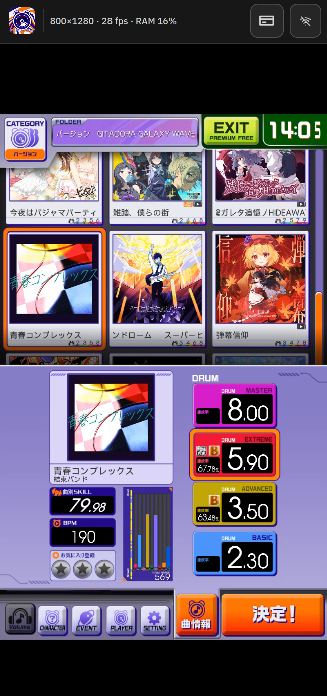

# spicefe

> [!WARNING]
> **仅限在可信局域网中使用。** spice2x 通过明文 HTTP 发送未经身份验证的
> 视频；可选的 API 密码使用已过时的 RC4；spicefe 还会将保存的密码以明文
> 存入浏览器 `localStorage`。通过 HTTP 加载的 spicefe 页面也可能在传输途中
> 被篡改。桌面浏览器支持时，应优先使用仅针对本站的 HTTPS 例外，并且只通过
> 你信任的静态托管服务部署已审查过的构建产物。服务器分享链接和二维码可能
> 包含 API 密码；其中的 Base64URL 内容只是编码，并未加密，而且可能出现在
> 静态托管服务的请求日志中。请只在可信设备和可信用户之间分享。

[English](./README.md)

[](https://github.com/Avimitin/spicefe/actions/workflows/ci.yml)

## 界面展示

| 欢迎页 | 已保存服务器诊断 |
| :---: | :---: |
| [](./docs/screenshots/welcome.png) | [](./public/assets/showcase/server-library.png) |

| 卡片管理 | 串流中插卡 |
| :---: | :---: |
| [](./public/assets/showcase/card-library.png) | [](./public/assets/showcase/card-insert.png) |

**GITADORA GALAXY WAVE DELTA 实时副屏**

[](./public/assets/showcase/gitadora-stream.png)

**旧版 beatmania IIDX 米字屏**

https://github.com/user-attachments/assets/dab8b2ec-577d-4078-9c29-0bfeb0448908

`spicefe` 是一个可在全球静态托管、用于 spice2x 副屏视频流及旧版 beatmania
IIDX 机台米字屏的局域网客户端。在手机、平板或其他现代浏览器中打开页面，选择
已保存的游戏 PC，浏览器就会直接连接 spice2x，提供视频与触控输入，或显示
9 字符米字屏内容。

本项目不使用中继，也不要求在游戏 PC 上额外运行配套 Web 服务器。静态托管
服务只负责发送本应用；视频流和输入数据始终留在局域网内。

## 0.1 版本范围

- 优先使用 WebCodecs 播放 H.264，并提供 Media Source Extensions 回退路径
- H.264 不可用时自动回退到 MJPEG
- 为旧版 beatmania IIDX 提供可选的自适应红字黑底 9 字符米字屏；通过 spice2x
  `iidx.ticker_get()` 读取，不会打开视频端点
- 欢迎页和已保存服务器页相互独立，可从顶部导航切换；首次使用默认显示
  欢迎页，已保存服务器的用户默认进入服务器列表
- 在每个服务器旁分别显示主机、控制 API 与视频服务器状态及各自的失败原因；
  服务器列表可见时每分钟刷新一次
- 支持鼠标、单点触控和多点触控输入
- 支持适应（Fit）、填充（Fill）和拉伸（Stretch）显示模式，并正确映射触控坐标
- 视频内的调整栏可以关闭，并可从顶部栏重新打开
- 提供浏览器本地 e-amusement 卡片库，支持原生格式卡号生成、从 spice2x 卡片文件
  和卡号覆盖项选择性导入、从串流工具栏向 P1/P2 插卡、选择性 ZIP 备份，以及
  自定义卡片外观
- 在 `localStorage` 中保存多个具名连接配置，并可为每个配置选择按游戏分类的
  图标，或上传自动居中裁剪的本地图像，显示在 PC 名称旁
- 可将已保存服务器导出为二维码或直达链接；接收设备会先预览，再由用户明确
  确认保存
- 明确的连接、断开和切换行为；刷新页面后绝不会自动重连
- 提供英文和简体中文界面；自动检测浏览器语言，并保存手动选择
- 提供独立的浏览器设置页，包含 iOS、iPadOS、Windows 与 Android 上 Safari、
  Edge、Chrome 和 Firefox 的操作说明
- 断开连接时立即清除最后一帧视频和所有播放后端
- 自适应手机、平板和桌面设备的界面

音频、剪贴板共享、同时显示多个副屏、广域网中继和旧版浏览器均不在此版本
的范围内。

## 数据路径

界面中填写的 API 端口是 spice2x 的基础端口：

| 用途 | API 端口为 1337 时的浏览器端点 | 保护方式 |
| --- | --- | --- |
| 触控、游戏信息、卡片导入/插卡及 IIDX 米字屏 | `ws://PC:1338` | 卡片导入要求设置 spice2x 密码；使用旧式 RC4 |
| H.264 或 MJPEG 视频 | `http://PC:1339` | 无 |

CDN 不会代理上述任何连接。可用时，浏览器通过 WebCodecs 直接解码 H.264，并在
每次屏幕刷新时只绘制解码器批量输出的最新一帧。否则，固定版本的纯 JavaScript
jMuxer 会在客户端将 Annex-B 重新封装为供 MSE 播放的分片 MP4，不会对视频进行
转码。

已保存服务器页面会短暂打开配置中的 API WebSocket，发送与完整会话建立时相同的
只读 `info/avs` 查询。普通视频配置还会向视频端点发送 `HEAD` 请求；spice2x 会在
分配画面捕获前响应，因此不会启动编码器，也不会与视频观看者争用画面。米字屏配置
绝不会访问视频端点，而是在 API 检查成功后发送只读的 `iidx/ticker_get` 请求。
列表打开时会立即检查一次，列表持续可见时每分钟再次检查；浏览器恢复联网后也会
立即检查。

任一服务作出响应，都足以确认该主机的局域网路由可用。因此，API 认证可以显示为
红色，而主机仍保持绿色。若两个服务均未响应，spicefe 会显示**无响应**，而不会
声称浏览器能够进一步区分主机离线、路由故障、防火墙规则或被拦截的局域网请求。

## 自定义服务器图标

在连接配置中打开游戏图标选择器，然后点击**上传图片**，即可使用 PNG、JPEG 或
WebP 文件。spicefe 会在本设备上取图片中央最大的正方形，并缩放至最大 384×384；只有
处理后的结果会保存到浏览器 `localStorage`，原始文件不会被上传。已保存的图像会
显示在选择器顶部的**自定义图标**分类中，可供多个服务器配置重复使用，最多保存
24 个。移除图标后，引用它的配置会改为显示 spice2x 默认图标。

## 分享服务器配置

点击已保存服务器卡片上的二维码按钮，即可生成可扫描的二维码和直达链接。
可移植配置包含名称、主机地址、API 端口、API 密码、内置游戏图标、视频参数、
画面模式及 IIDX 米字屏模式。本地上传的自定义图标不会随链接导出；接收设备会
改用默认 spice2x 图标。

打开链接后，spicefe 会读取带版本号的 `spicefe-profile` 查询参数，立即从当前
地址中移除该参数，并显示解码后的设置供用户确认。点击**保存服务器**会新增配置；
若已有相同主机地址和 API 端口，则更新该配置。恢复配置绝不会自动发起连接。
链接中的 `spicefe-host` 和 `spicefe-port` 会直接显示其中包含的 spice2x 连接；
开头的页面地址仍然代表 spicefe 静态网站，因此修改游戏 PC 时不会变化。若可读
地址与编码配置不一致，接收端会拒绝该链接。
保存前会严格验证内容，但 Base64URL 只是编码，并不是加密。若配置中含有密码，
任何取得链接的人都能还原密码；首次打开时的完整请求地址也可能留在静态托管服务
或浏览器记录中。请只在可信局域网内的可信设备之间使用此功能。

## 旧版 IIDX 米字屏

创建或编辑连接时，如果运行的是带机台米字屏的旧版 beatmania IIDX，请启用
**启用米字屏**。此选项会随配置保存，之后也可关闭。启用后会隐藏视频流画质设置，
因为 spicefe 只连接控制 API，并以 10 Hz 调用原生只读函数
`iidx.ticker_get()`，不会连接视频服务器。

点击选项旁的**预览米字屏**，无需服务器或游戏即可测试同一套显示渲染器。输入
任意长度的预览文字：不超过 9 个字符时保持静止，较长文字每 0.5 秒向前移动一个
字符，并在空白间隔后循环。选择**截图模式**即可隐藏全部控件；轻触任意位置便会
恢复控件。预览完全在本地运行，不会尝试连接 spice2x。

显示区域严格限制为 9 个字符，与 spice2x 及原始机台硬件一致；固定使用 27:5
比例，随设备屏幕放大或缩小，并以纯黑底、纯红字和克制的荧光辉光还原机台效果。
独立外框现已移除：Logo、标题图及显示区域直接嵌在覆盖整个米字屏画面（包括全屏
模式）的拉丝金属背景上。仅 Logo 与标题图表面覆盖克制的透明塑料反光，红色米字屏
窗口不受遮挡。较新的 IIDX 可能只有副屏，此时请关闭该选项并使用普通视频模式。

## 虚拟卡片

从左上角页面菜单打开**卡片库**，即可创建和编辑虚拟 e-amusement 卡片。新卡片的
ID 默认为空。点击**随机生成**会使用原生格式：`E0040100` 后接 8 位随机十六进制
字符。若要复用游戏 PC 上已生成的卡片，请点击**从游戏 PC 导入**。spicefe 会建立
一个短时 API 连接，并列出每个有效读卡器当前选中的卡片。只勾选需要的卡片，再点击
**导入所选卡片**。扫描过程中关闭选择窗口会立即断开该临时连接。文件卡片会保留
文件名；API 来源为 `override` 的卡片（包括 `-card0`、`-card1`）会分别命名为
`card0`、`card1`。已有卡片仍会显示，但无法选择或覆盖。导入功能要求 spice2x 与
已保存的服务器配置均设置 API 密码。手动输入的 ID 必须为 16 位十六进制字符。

卡片默认采用 Untitled UI 的浅灰样式，也可改为对应的深灰样式、纯色、透明渐变
样式，或上传 PNG、JPEG、WebP 图片作为背景。图片会在当前设备上缩放，并随卡片
保存在浏览器 `localStorage` 中；spicefe 不会上传图片。名称过长时仍保持单行，并在
固定名称区域内水平滚动。卡号使用本地提供的 Bitcount Single 可变字体，加载失败时
回退到设备的等宽字体。

若要在游戏 PC 上复用浏览器创建的卡片，请在需要的卡片下方勾选**选择备份**，再点击
**导出备份**。下载的 ZIP 会为每张所选卡片生成一个 `<卡片名称>.txt` 文件；文件中
仅包含 16 位卡片 ID，不含浏览器元数据，因此可直接在 spice2x 卡片管理器中选择使用。
已有的 `.txt` 后缀会保留；导出时会调整 Windows 不允许或过长的文件名及重复名称，
避免解压时丢失卡片。

视频或米字屏会话连接后，点击顶部栏中的卡片图标，选择玩家 1 或玩家 2，再选择卡片。
spicefe 会通过当前控制 API 连接发送原生的
`card.insert(reader, card_id)` 请求，并自动关闭菜单。

## 游戏 PC 设置

请安装[最新版 spice2x](https://github.com/spice2x/spice2x.github.io/releases)。
最低支持版本为
[`spice2x-26-08-20`](https://github.com/spice2x/spice2x.github.io/releases/tag/26-08-20)；
该版本加入了所需的副屏视频流及 CORS 支持。使用副屏视频时，以类似下方的参数
启动游戏：

```text
spice64.exe ... -api 1337 -apipass choose-a-lan-password -apistream
```

旧版 IIDX 米字屏只需要 API，不需要视频服务器：

```text
spice64.exe ... -api 1337 -apipass choose-a-lan-password
```

密码是可选项，但 spice2x 建议设置密码。在 Windows 防火墙中允许浏览器 API
使用的 TCP 1338 端口；使用视频时还需允许 1339。浏览器不会使用 1337 上的
原始 TCP 监听器，但 spice2x 仍然需要 `-api` 才会建立浏览器使用的监听器。
卡片导入要求 spice2x 版本包含受密码保护的 `card.get_cards()` API；未设置 `-apipass`
时不会执行导入。

在客户端设备上，应尽可能填写 PC 的私有 IPv4 地址，例如 `192.168.1.50`。
两台设备必须位于同一局域网，并且 Wi-Fi 网络必须关闭客户端隔离功能。

## 浏览器设置

spice2x 当前只提供明文 HTTP 和 WebSocket 端点。因此，从全球托管的页面访问
它时，无法绕过以下浏览器安全边界：

> [!IMPORTANT]
> 下表要求使用 HTTP 页面时，请手动输入完整地址：
> **`http://spice.nimabe.net/`**。不要只输入域名；浏览器历史记录与地址栏自动
> 补全可能会改用之前访问过的 HTTPS 地址。

| 设备与浏览器 | 推荐页面 | 操作方式 |
| --- | --- | --- |
| iPhone 或 iPad · Safari | HTTP | 新建标签页，输入上方完整的 `http://` 地址，并确认加载后的地址仍以 `http://` 开头。如果 Safari 将其升级为 HTTPS，请使用本地服务器工具。 |
| Windows · Edge 或 Chrome | HTTPS | 打开本站权限，允许**不安全内容**，并在浏览器询问时允许**本地网络访问**。 |
| Windows · Firefox | HTTPS | 打开地址栏锁形图标中的连接安全面板，选择**暂时解除保护**，然后允许访问本地网络设备。 |
| Android · Edge 或 Chrome | HTTP | 如果已启用**始终使用安全连接**，请暂时关闭；输入完整的 `http://` 地址，再允许本地网络访问。 |

应用内提供了相同的双语说明；在左上角页面菜单中选择**浏览器设置**即可打开。
该页面会显示当前部署对应的完整 HTTP 地址，并提供复制按钮。如果公共域名仍因
HSTS、浏览器策略或网络策略而升级为 HTTPS，请使用下文所述的 Windows 本地
服务器工具。

HTTP 与 HTTPS 是不同的浏览器来源，因此各自拥有独立的 `localStorage`。为了
避免把密码放入 URL，应用不会在两者之间复制保存的连接配置；切换到 HTTP 页面
后，请重新填写一次服务器信息。

因此，部署必须同时提供 HTTP 和 HTTPS，且不能把所有 HTTP 流量重定向到 HTTPS，
公共 HTTP 页面才能正常使用。

相关平台资料：

- [Chrome 网站权限](https://support.google.com/chrome/answer/114662)
- [Android Chrome 安全连接设置](https://support.google.com/chrome/answer/10468685?co=GENIE.Platform%3DAndroid&hl=zh-Hans)
- [Edge 本地网络访问](https://support.microsoft.com/zh-cn/edge/control-a-website-s-access-to-the-local-network-in-microsoft-edge)
- [Edge HTTPS-First 模式](https://support.microsoft.com/zh-cn/edge/secure-your-web-browsing-with-https-first-mode-in-microsoft-edge)
- [Firefox 混合内容控制](https://support.mozilla.org/zh-CN/kb/mixed-content-blocking-firefox)
- [Firefox 本地网络权限](https://support.mozilla.org/zh-CN/kb/control-personal-device-local-network-permissions-firefox)
- [Safari 地址栏说明](https://support.apple.com/zh-cn/guide/iphone/iph1fbef4daa/ios)
- [W3C Mixed Content](https://www.w3.org/TR/mixed-content/)
- [WebCodecs AVC 注册说明](https://www.w3.org/TR/webcodecs-avc-codec-registration/)

## 部署静态站点

先运行完整的可复现构建及测试检查：

```sh
nix flake check
nix build
```

可部署目录为 `result/`。仓库中的 `public/` 目录也已经包含完整产物，无需构建
即可直接上传。运行 `nix build .#release` 可生成带有 Windows 本地服务器工具的
下载用 ZIP。

### GitHub Actions

[`CI` 工作流](./.github/workflows/ci.yml)会在 Pull Request 及向 `main` 推送时
运行。它会执行全部 flake 检查、构建站点、确认仓库中的 `public/` 与 Nix 构建
结果一致，并将结果作为保留七天的 `spicefe-public` 构建产物上传。

成功推送到 `main` 后，工作流还会把同一份解除符号链接后的输出上传为 GitHub
Pages 专用构建产物，并由独立任务进行部署。Pull Request 保持只读权限；只有
部署任务会取得 `pages: write` 和 `id-token: write`。工作流绝不会提交生成文件，
因此不需要维护由 CI 生成的 `gh-pages` 分支。

每次推送 Git 标签时，[`Release` 工作流](./.github/workflows/release.yml)都会运行。
它会重新执行 flake 检查、构建 `release` 包，并创建 GitHub Release，附上带版本号
的 ZIP、SHA-256 校验文件及自动生成的发行说明。压缩包完全由 Nix 从 Pages 使用的
同一个站点 derivation 构建。例如：

```sh
git tag v0.2.0
git push origin v0.2.0
```

如果该标签的 Release 已存在，重新运行工作流会替换两个自动生成的构建产物，
而不会创建重复 Release。

要启用部署，请打开 GitHub 仓库的 **Settings → Pages**，将 **Source** 设为
**GitHub Actions**。请配置自定义域名，并保持 **Enforce HTTPS** 关闭，使该域名的
HTTP 页面仍可访问；默认的 `github.io` 地址无法提供这样的 HTTP
入口。如果域名使用 Cloudflare DNS，请将记录保持为 **DNS only（灰云）**，且
不要在 GitHub Pages 前方的其他服务中启用 HSTS 或 HTTPS 重定向。

GitHub Pages 不处理 `_headers`，因此 Cloudflare Pages 使用的自定义响应头不会
应用在这个部署目标上。这不会改变直连局域网服务的设计，但与支持这些响应头的
托管平台相比，浏览器策略层面的加固会少一些。

GitHub Actions 与 NixOS 官方安装器均固定到完整 commit ID。安装器可执行文件
还固定为 Nix `2.35.1`，并且会在运行前用仓库中记录的 SHA-256 校验。

### EdgeOne Pages

直接上传 `public/`（或 `result/` 的内容）。其中的 `edgeone.json` 会设置响应
头。在域名的 HTTPS 设置中保持 **Force HTTPS** 关闭，以确保
`http://your-client-domain` 仍可访问。

### Cloudflare Pages

不选择框架、不设置构建命令，并将 `public` 设为输出目录。Pages 会读取其中的
`_headers` 文件。请使用自定义域名并为该域名关闭 **Always Use HTTPS**；不要
在客户端域名上启用 HSTS。`pages.dev` 域名无法提供所需的公共 HTTP 页面。

上述部署设置可参考
[GitHub Pages 自定义工作流](https://docs.github.com/zh/pages/getting-started-with-github-pages/using-custom-workflows-with-github-pages)、
[GitHub Pages HTTPS 配置](https://docs.github.com/zh/pages/getting-started-with-github-pages/securing-your-github-pages-site-with-https)、
[EdgeOne 直接上传](https://pages.edgeone.ai/document/direct-upload)、
[EdgeOne HTTPS 配置](https://pages.edgeone.ai/document/https-configuration-overview)、
[Cloudflare Pages 响应头](https://developers.cloudflare.com/pages/configuration/headers/)
和 [Cloudflare Always Use HTTPS](https://developers.cloudflare.com/ssl/edge-certificates/additional-options/always-use-https/)。

## 本地部署

应用左上角菜单中的**自行托管**页面，提供了相同的中英文安装、网络、更新与
故障排查指南。当公共域名因 HSTS 或浏览器策略被升级为 HTTPS 时，自行托管是
最可靠的方案。

### Windows Release 工具

Windows 没有提供独立的 `cmd.exe` Web 服务器命令，而 IIS 是可选系统组件，对此
用途过于复杂。仍受支持的 Windows 客户端均自带 Windows PowerShell 5.1，因此
Release ZIP 中提供了 `serve.bat`，以及一个基于 .NET `TcpListener` 的小型
PowerShell 静态服务器。

在游戏 PC 上直接提供 spicefe 页面：

1. 下载 Release ZIP 及对应的 `.sha256` 文件，验证后解压 ZIP。
2. 双击 `serve.bat`。服务器会监听 `45000` 端口，并打开本机测试页面。
3. Windows 防火墙询问时，只允许访问**专用网络**。
4. 在手机或平板中打开服务器窗口显示的任一蓝绿色局域网地址，例如
   `http://192.168.1.50:45000/`。
5. 游戏期间保持窗口开启；按 **Ctrl+C** 即可停止服务器。

解压前，可在 PowerShell 中校验 ZIP，并将结果与下载的 `.sha256` 文件比较：

```powershell
Get-FileHash .\spicefe-vX.Y.Z.zip -Algorithm SHA256
```

也可在命令提示符中运行 `serve.bat 8080` 来指定其他端口。该工具不会安装系统
服务、修改防火墙规则、要求管理员权限或下载任何内容。执行策略绕过仅对这一个
PowerShell 进程有效。它只适合可信局域网，不应暴露到互联网。

实现仅依赖 Windows 自带的
[Windows PowerShell 5.1](https://learn.microsoft.com/zh-cn/powershell/module/microsoft.powershell.core/about/about_windows_powershell_5.1?view=powershell-5.1)
和 [.NET `TcpListener`](https://learn.microsoft.com/zh-cn/dotnet/api/system.net.sockets.tcplistener)。

### 在 Linux 或 macOS 上使用 Nix

使用带 Release 标签的仓库检出版本，可得到可复现的本地部署：

```sh
git clone https://github.com/Avimitin/spicefe.git
cd spicefe
git checkout vX.Y.Z
nix flake check
SPICEFE_BIND=0.0.0.0 SPICEFE_PORT=45000 nix run
```

Nix 会构建与 CI 相同、依赖已固定的站点，并提供 Python 服务器；无需全局安装
npm。`0.0.0.0` 会让页面可从局域网访问，因此应将电脑防火墙限制在可信或专用
网络。游戏期间保持进程运行，按 **Ctrl+C** 即可停止。

### 打开与维护本地页面

- 手动输入工具显示的完整蓝绿色 URL，包括 `http://` 与 `:45000`。不要在手机上
  使用 `127.0.0.1`，它会指回手机自身。
- 页面无法打开时，先在服务器 PC 上测试 `127.0.0.1`，再检查局域网地址、专用
  网络防火墙权限、是否连接同一 Wi-Fi，以及客户端隔离。
- 页面能打开但串流失败，说明静态部署已经正常；请检查 spice2x API 视频流设置、
  spice2x 版本、API 端口与密码，以及 spice2x 自己使用的防火墙端口。
- 更新时，先停止旧服务器，把经过校验的新 Release 解压到新文件夹，再用相同地址
  与页面端口启动。浏览器会保留该来源下保存的连接配置。
- 不要通过路由器端口转发对外暴露该工具。高级用户可用其他 HTTP 静态服务器提供
  `result/` 或 `public/`，但必须保留正常的 JavaScript 与 WOFF2 MIME 类型；不支持
  通过 `file://` 直接打开 `index.html`。

## 本地开发

flake 固定了 Nixpkgs，并提供 Node.js、TypeScript、esbuild 与 Python；无需在系统中
全局安装 npm 包，也不会使用 npm 提供的构建二进制文件。

```sh
nix develop
npm ci --ignore-scripts
npm run build
npm test
python tools/check_static.py public
```

在开发机上启动构建后的站点：

```sh
nix run
```

默认监听 `127.0.0.1:45000`。如需让其他局域网设备访问：

```sh
SPICEFE_BIND=0.0.0.0 SPICEFE_PORT=45000 nix run
```

## 依赖策略

浏览器依赖均为纯 JavaScript 包：`react@19.2.8`、`react-dom@19.2.8`、
`scheduler@0.27.0`、`jmuxer@2.1.1` 与 `qrcode-generator@2.0.4`。npm
完整性元数据将它们锁定在精确版本，并禁用安装生命周期脚本。TypeScript 与
esbuild 由固定的 Nixpkgs 提供，而非 npm。完整许可证和来源记录位于
`public/vendor/`；构建不会下载或运行任何来自 npm 包的可执行二进制文件。

## 界面与字体资源

界面借鉴了采用 MIT 许可证的开源
[`untitleduico/react`](https://github.com/untitleduico/react) 设计系统，包括其中性
配色、紧凑组件尺寸、焦点状态及克制的阴影。交互式集合正迁移至 React 与
TypeScript，部署结果仍然是纯客户端静态站点；Tailwind CSS 与 React Aria
都不是运行时或构建依赖。

界面首选 IBM Plex Sans。站点固定使用 IBM
[`@ibm/plex-sans@1.1.0`](https://github.com/IBM/plex/releases/tag/%40ibm%2Fplex-sans%401.1.0)
发布版中的四个小型 Latin-1 与符号子集（Regular 和 Medium），并从同一静态来源
提供。CSS 会优先检查设备中已安装的 IBM Plex Sans；本地存在时不会下载字体文件。
欢迎页主标题使用自托管的
[Libre Caslon Text](https://github.com/impallari/Libre-Caslon-Text) Regular；
项目将其上游精确版本固定为非 flake Nix 输入，并通过 Nix 将 TTF 可复现地转换为
WOFF2，同时验证仓库中的浏览器字体文件。CSS 会先检查设备中已安装的字体，中文
标题使用设备本地的衬线后备字体。其他文字也使用本地系统后备字体，页面不会访问
字体 CDN 或实时第三方资源。虚拟卡片的卡号使用
[Bitcount Single](https://github.com/petrvanblokland/TYPETR-Bitcount)；项目将
所请求的可变 TTF 固定到精确版本，再由 Nix 可复现地转换为本地提供的 WOFF2，
并保留设备等宽字体作为回退。
旧版 IIDX 米字屏使用 Jack Sivak 制作的
[Sixteen 等宽字体](https://stuffjackmakes.com/sixteen-font/)。项目将上游精确版本固定为
非 flake Nix 输入，并从本地提供字体，不依赖字体 CDN。显示区会在活动文字下方叠放
九个暗灰色的全亮字形，以呈现未点亮的线段。Sixteen 独立采用 SIL Open Font
License 1.1，可用于商业及非商业应用；站点中附带完整许可证和来源记录。

## 图标来源

站点图标及连接配置的默认图标，是来自固定版本 `b9c8afb` 的未经修改的 spice2x
官方图标；站点中同时提供其 GPLv3 许可证。连接图标选择器还包含
[`bicarus-dev/bemani_fan_site_icons`](https://github.com/bicarus-dev/bemani_fan_site_icons)
固定版本 `225e494` 中的 22 个白名单图像：上游提供的全部 18 个 beatmania IIDX
街机图标（覆盖 18–33，并包含预发行与场测版本）、GITADORA GALAXY WAVE DELTA、
SOUND VOLTEX 6–7 及 pop'n music High Cheer；不包含 INFINITAS 和 ULTIMATE
MOBILE。选择器按游戏分类；Nix 构建会依据白名单重新生成部署用图标目录，不会发布
上游的其他图像。

BEMANI 图标仓库没有提供许可证，并说明这些图像收集自 KONAMI BEMANI 粉丝
站点。站点运营者必须自行取得重新分发或公开提供这些图像所需的许可。本项目
不表示与 KONAMI 或各游戏存在关联，也不代表其认可。完整来源记录及上游
README 位于
[`public/vendor/bemani-fan-site-icons/`](./public/vendor/bemani-fan-site-icons/)。

米字屏本地提供的拉丝金属背景，是仓库所有者指定使用的未经修改 WallArt 图片。
其直接来源未注明再分发条款，因此该素材不属于 spicefe 的 MIT 许可证范围；来源、
校验和及获取信息记录在
[`public/vendor/brushed-metal/`](./public/vendor/brushed-metal/)。

通过自定义图标选择器上传的图像只保存在浏览器本地，不属于站点发行内容，也不在
上游 BEMANI 图标白名单内。

## 安全模型

仅限在可信的家庭局域网中使用：

- spice2x 以明文发送视频，且视频流端口没有身份验证。
- 可选的 API 密码使用 RC4；这是旧式加密，不是现代安全信道。
- 为了在重新打开页面后立即使用，连接配置及密码会有意以明文保存在浏览器
  `localStorage` 中。
- 上传的服务器图标及虚拟卡片图像会以编码后的图片数据保存在当前浏览器来源的
  `localStorage` 中；spicefe 不会上传这些内容。
- HTTP 页面无法验证传输中的静态应用。网络攻击者可能替换其中的 JavaScript，
  因此可用时应优先使用文档所述、仅针对本站的 HTTPS 例外，并且只在可信网络中
  使用 HTTP 页面。
- 部署后的静态托管服务控制着可访问已保存配置及局域网端点的可执行代码。
  请部署经过审查的产物，并使用你信任的托管服务。

本项目不包含遥测、远程账户、Service Worker，也不会在页面加载时自动连接。

## 致谢

协议和客户端行为基于 spice2x 源码树及采用 BSD 许可证的参考客户端
[`spice2x/substream`](https://github.com/spice2x/substream)。站点标识使用 spice2x
官方图标，可选游戏图标来自 `bicarus-dev/bemani_fan_site_icons`；界面样式借鉴
开源 Untitled UI React，并使用 IBM Plex Sans，欢迎页主标题使用 Libre Caslon Text。
许可证、固定版本以及 BEMANI 图像的注意事项详见
[THIRD_PARTY_NOTICES.md](./THIRD_PARTY_NOTICES.md)。
